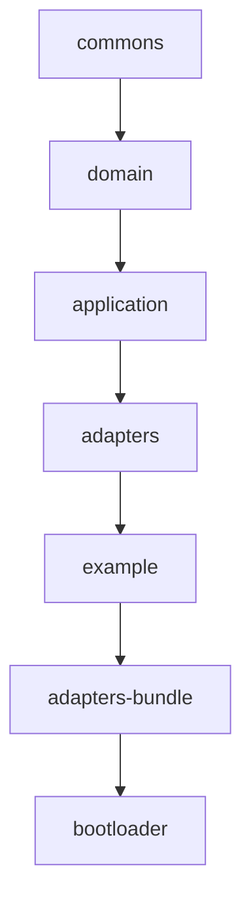

# spring-hexagonal

`sprint-hexagonal` is a Spring Boot native application template built with Kotlin and Maven. It follows a clean/hexagonal architecture, facilitating the creation of new projects with modern technologies and native image support.

## Modules

- **commons**: Contains common utilities and shared code.
- **domain**: Includes core domain entities and business logic.
- **application**: Manages application services and use cases.
- **adapters**: Contains adapters for different frameworks and technologies.
    - **example**: Demonstrates integration with Spring Boot and Jackson.
- **adapters-bundle**: Bundles multiple adapters.
- **bootloader**: Bootstraps the application.

## Technology Stack

- **Kotlin**: For concise and expressive code.
- **Spring Boot**: For application configuration and management.
- **Maven**: As the build and dependency management tool.

## Dependency Structure


## Native Image Support

The project includes support for native image generation using GraalVM.

## Usage

To use this template:

1. **Clone the repository**:
    ```bash
    git clone https://github.com/your-username/spring-hexagonal.git
    cd spring-hexagonal
    ```

2. **Build the project**:
    ```bash
    mvn clean install
    ```

3. **Run the application**:
    ```bash
    mvn spring-boot:run -pl bootloader
    ```

## Next Steps

Once the project is set up, you can start developing your application by modifying and adding new modules, services, and components as per your requirements.
